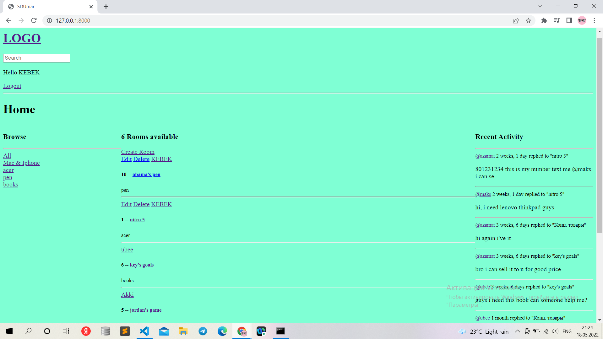
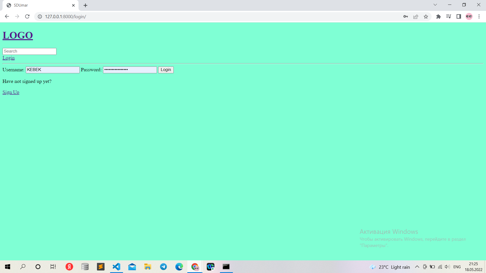
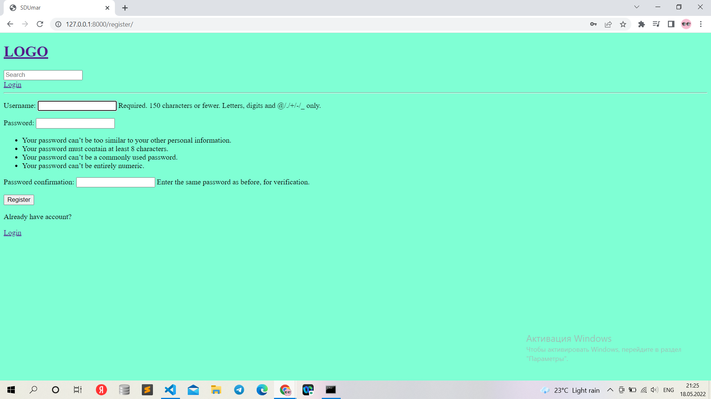
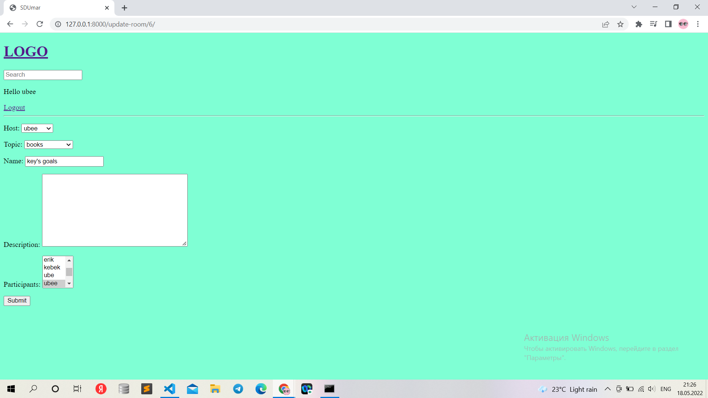
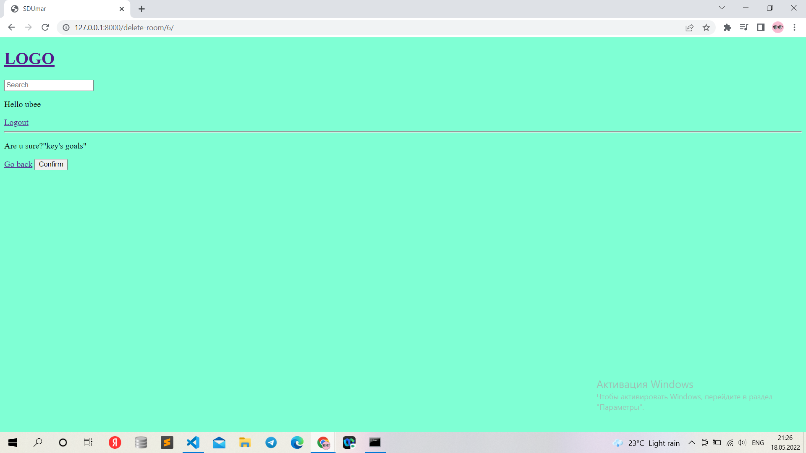

# SDUMarket

It's my project for INF 232 Web programming: Back-end course.

# Teacher 

Bissenbay Dauletbaev - [Gmail](https://mail.google.com/mail/u/1/#search/b.dauletbayev%40sdu.edu.kz?compose=new)

# Student

200103531 Token Bauyrzhan

# Structure

There are three models, rooms, themes, messages.
When you first log in, an unknown user in the system must register or if you already have a current account, you can log in from it. 
That is, each action checks whether the user exists or not. Of course, the user can change, delete or create his own room (but there are no other users' rooms).
It is also required for delete messages

# Screnshots

![logout view in site][(logout view in site.png)](https://github.com/200103531BAUYRZHANTOKEN/SDUMarket/blob/main/logout%20view%20in%20site.png)

# Used framework
- django 4.0.2

# Installation
- $ git clone [Github](https://github.com/200103531BAUYRZHANTOKEN/SDUMarket/) fileName
- $ cd venv
- $ cd Scripts
- $ activate.bat
- $ cd scr 
- $ cd SDUMarket
- $ py manage.py runserver

